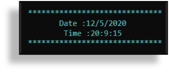

# Student-Progress-Indicator-SPI

| WELCOME TO SPI(STUDENT PROGRESS INDICATOR) |

 ---------------
| Introduction |
 ---------------

Student progress indicator or "SPI" was built with a view to reduce the paper work, increase the use of digital medias. It is a complete C++, console based system. We have tried to complete the full project with all of the required criteria's. But still there must be some update with some new features and characteristics. Stay tuned with us to get more special features.

Thank you everyone.

>> YouTube video link: https://youtu.be/W-WLPlPVl8s

-------------------
| Required System |
-------------------

 >> Any version of windows operating system which is compatible to run CodeBlocks.
 >> CodeBlocks

--------------------------
| Minimum Specifications |
--------------------------

    1. Operating System : Windows® 7/8/10/11
    2. Processor	: Intel® Core™ i3
    3. Memory		: 1 GB RAM
    4. Graphics		: Not Required
    5. Network		: Broadband Internet Connection
    6. Storage		: 500 MB

-------------------------------------------------
| How to run [Using CodeBlocks(.cpp extension)] |
-------------------------------------------------

 >> Open "SPI_Student_Progress_Indicator.cpp" in the CodeBlocks.
 >> CodeBlocks will open the code for the SPI(Student Progress Indicator).
 >> Press on the "Build & Run" option from the above toolbox.
 >> The system will be ready to use.

---------------------------
| How to run (Using .exe) |
---------------------------

 >> "SPI" is also available in .exe format.
 >> Just double tap on the .exe file to install.
 >> After installation, you are welcome to use SPI.

--------------------
| How to use "SPI" |
--------------------

 >> If you want to run through .cpp file, make sure your console box is in the full screen and font size is '20'.
 >> To get access to the administrative permissions, administrator password is: passwordadmin.
 >> If you are new to SPI, make sure you have signed up as a "Faculty".
 >> After sign up log in as a "Faculty" to add student marks and results.
 >> If student result is in database, the student need to login only to get student access.
 >> There are 3 different users: Admin, Faculty & Student.

	---------
	| Admin |
	---------

   1. Display All Student Result	   - A table which will show all the students detail.
   2. Display All Faculty Information	   - A table which will show all faculties information.
   3. Display Specific Faculty Information - Search with faculty Id for a perticular faculty informations.
   4. Remove A Faculty Information	   - Search with faculty Id to remove a perticular faculty informations.
   5. Remove All Faculty Information	   - Remove all faculties information.
   6. Remove All Student Result		   - Remove all students result.

	-----------
	| Faculty |
	-----------

   1. Add Result			   - A faculty can add midterm and finalterm result of any student.
   2. Show Individual Result		   - By searching through student Id, faculty can see perticular student results.
   3. Display All Student Result	   - A table which will show all students result.
   4. Delete Individual Student Result	   - Search with student Id to remove a perticular student results.

	-----------
	| Student |
	-----------

   1. Show Individual Marks		   - Search with student Id to view a perticular student result.
   2. Show All Student Marks		   - A table which will show all student results.

---------------------------
| Background Informations |
---------------------------

Digitization has revolutionized the information, media, and all industry sector. In this advanced world, everything is being digital. So, to maintain the sequence with the daily update  of this volatile world, we also need to be updated. But still, most of our work or document is paper based.

From research, we found that, about 19 million student is available in Bangladesh. In most of our public and private schools, student progress sheet is considered as a very important document for a student’s future activity. But currently all these progress reports are paper based. School authority publishes the report card only after the term test and only on that time student and their parents can observe the result of their child. But a student should be monitored on a daily basis of his/her daily studies.

From this point onward, the system is going to be introduced here is "Student Progress Indicator" or "SPI" in short. Through this system evaluation of a student is much more easier and effective.

||						Developer's Informations						||

 1. Niloy Kanti Paul
    Email	: niloykantipaul@gmail.com
    LinkedIn	: https://www.linkedin.com/in/niloy-kanti-paul-5543181ab/
    Github	: https://github.com/DEV-NKP

 2. Kaushik Biswas
    Email	: biswaskaushik.2020@gmail.com
    LinkedIn	: https://www.linkedin.com/in/kaushik-biswas-2b6554243/
    Github	: https://github.com/Kaushik-Biswas

 3. FAIZA TASNIM
    Email	: 
    LinkedIn	: 
    Github	: 

 4. SHARIA TASNIM ADRITA
    Email	: 
    LinkedIn	: 
    Github	: 

||						Project Highlights						||

#At the very first, a landing page holding developer's information will be presented.

#SPI has a unique and colorful designed logo.

#SPI has the automated real time and date in every page.

#After every sucessful operations, you may see a lazy loading which helps to make more stable and decorated system.

#Whenever you want to enter in the admin section you need to input valid administrator password to get access. Administrator password is also recommended to add any faculty member.

#If you are admin, you can perform some adminstrator works in the system.

#As an Admin, admin have the power to delete all faculty under the system.

#After entering the administration password, you may add any faculty. But make sure the faculty id need to be unique everytime.

#A faculty must need to provide valid ID and Password to enter inside the system.

#If you are a faculty, faculty can add, delete, search any student result/informations.

#If you have logged in as a faculty, faculty can add any student result/informations.

#A Faculty, Student & Admin can view all student result of the class.

#A faculty can delete a particular student informations.

#A Student, as well as a Faculty can view a particular student resultby searching Student ID in the system.

#If any student information is provided by any faculty, then a Student can only log in with his/her name and ID.

#After successful student login, a student can view some options provided for a Student.

#Whenever you want to exit from the system, you will be asked twice to be sure you want to exit. If you press 'y/Y', an exit page will appear.

********************************************ⒸAll Rights Reserved By "TEAM_DELTA"********************************************

